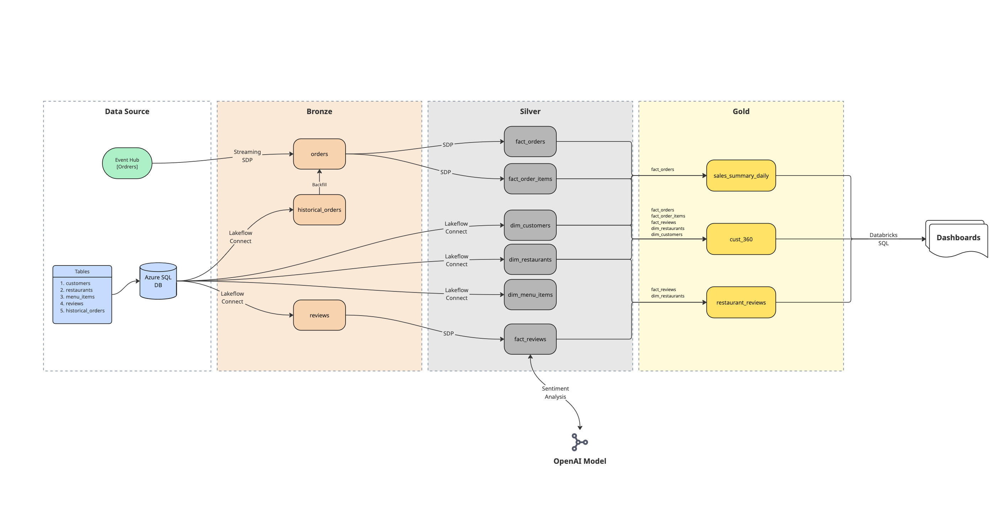

# 🍔 Restaurant Chain Streaming Data Pipeline

-231F20?style=for-the-badge&logo=apachekafka&logoColor=white)

## 📖 Overview
This repository contains the codebase for an end-to-end streaming data pipeline built on **Databricks**. Designed for a large-scale restaurant chain, the platform processes real-time order events and historical operational data, applying a strict **Medallion Architecture** (Bronze, Silver, Gold). 

The platform transforms highly normalized relational data and raw JSON streams of orders into a Kimball-style Dimensional Model that power high-performance customer, and resturant sentiment dashboards.

## 🎯 Objective
The primary objective of this project is to build a reliable streaming architecture while serving as a practical implementation to learn modern **Databricks** features. Specifically, it demonstrates:
* **Databricks Lakeflow Connect:** For seamless, native Change Data Capture (CDC) ingestion from relational databases.
* **Spark Declarative Pipelines (SDP):** Utilizing native Python decorators—such as `@dp.table` and `@dp.materialized_view` to declaratively structure pipelines.
* **Data Quality Management:** Implementing robust data validation on streaming queries using pipeline expectations (`@dp.expect_all_or_drop`).
* **Databricks AI/LLM Integration:** Utilizing the `ai_query` function to perform real-time NLP inference (sentiment and issue category extraction) directly within data pipelines.

## 🏗️ Architecture & Data Flow

The project implements an ETL pipeline that consumes event data from Kafka-compatible source, performs complex transformations, and handles relational CDC ingestion.

### 1. Data Sources
* **Azure Event Hubs (Kafka API):** Captures real-time incoming restaurant orders.
* **Azure SQL DB:** Stores operational tables including `customers`, `restaurants`, `menu_items`, `reviews`, and `historical_orders`.

* ** ER Diagram **

### 2. Ingestion & Bronze Layer (Raw Data)
* **Lakeflow Connect:** Connects directly to the Azure SQL DB, handling native Change Data Capture (CDC) to stream updates into Bronze staging tables (`historical_orders`, `reviews`).
* **SDP Streaming:** Subscribes to Event Hubs topic (`orders`), extracting and appending JSON payloads into the Bronze `orders` streaming table.

### 3. Transformation & Silver Layer (Cleansed & Modeled)
Data is cleansed, validated, and structured into a **Dimensional Model**:
* **Dimension Tables:** `dim_customers`, `dim_restaurants`, `dim_menu_items` (Ingested via Lakeflow Connect).
* **Fact Tables:** * `fact_orders` & `fact_order_items`: Created by unpacking and exploding complex JSON arrays from the Bronze streaming table.
  * `fact_reviews`: Streams raw reviews through an OpenAI model (`databricks-gpt-oss-20b`) via the `ai_query` SQL function. It parses the review-text into structured JSON, extracting sentiment and flagging specific operational issues (e.g., delivery, food quality, pricing).

* **Star Schema**

### 4. Aggregation & Gold Layer (Business Value)
Business logic is applied using PySpark Window functions and aggregations to create optimized Materialized Views for creating Dashboards:
* `sales_summary_daily`: Aggregates total revenue, average order value (AOV), and order types by date granularity.
* `cust_360`: Calculates customer lifetime spend, assigns loyalty tiers (Bronze to Platinum), and identifies customer characteristics like favorite restaurants and menu items.
* `restaurant_reviews`: Aggregates rating & sentiment distribution and categorizes complaints into pre-defined issues per resturant.

### 5. DFD

## 🛠️ Tech Stack & Core Tools

* **Compute & Orchestration:** Databricks (Spark Declarative Pipelines, Delta Live Tables, Lakeflow Jobs)
* **Processing Engine:** Apache Spark (PySpark, Spark SQL, Structured Streaming)
* **Storage Format:** Delta Lake
* **Message Broker:** Azure Event Hubs (configured with Kafka protocol)
* **Relational Database:** Azure SQL Database
* **AI / LLMs:** Databricks GenAI (`databricks-gpt-oss-20b`)
* **Visualization:** Databricks Dashboards

## 🎲 Synthetic Data Generation
To power this project, synthetic data generation scripts was written using Python (`Faker`, `pandas`) to simulate a realistic, large-scale restaurant chain environment.

* **Master Data Setup (`00_seed_restaurant_data.py`):** Generates core dimensional data including multiple restaurant branches across India, localized menu items (incorporating dynamic price adjustments per location), and a massive base of unique customers.
* **Historical Order Simulation (`01_historical_orders.py`):** Programmatically constructs randomized, complex JSON payloads representing historical orders (spanning a 6-month period), accurately tying together customers, restaurants, and randomly selected menu items with calculated subtotals.
* **Reviews (`02_reviews.py`):** Generates realistic customer reviews mapped directly to the historical orders. This script intelligently pulls the names of dishes ordered and inserts them into contextual review templates (ranging from 1 to 5 stars), creating the unstructured text data required to test the LLM sentiment extraction.
* **Real-time Streaming (`04_eventhub_orders.py`):** Continuously pushes newly generated order JSON payloads into Azure Event Hubs using the `azure-eventhub` SDK, simulating a live production stream.

## ⚙️ Azure SQL CDC & Lakeflow Connect Setup
To enable native, real-time ingestion into Databricks without custom streaming code, the Azure SQL Database was configured for Change Data Capture (CDC) via Lakeflow Connect.

* **Database Preparation:** Change tracking and CDC were enabled at both the database level (`ALTER DATABASE resturantsDB SET CHANGE_TRACKING = ON`) and the table level for all operational tables (`customers`, `historical_orders`, `menu_items`, `restaurants`, `reviews`).
* **Lakeflow Utility Scripts:** Databricks-provided utility stored procedures (`utility_script.sql`) were executed on the Azure SQL instance to enable CDC and CT on the database

## 📊 Analytics & Dashboards
The Gold layer powers several Databricks dashboards:

* **Daily Order Summary:** Tracks top-line metrics including Total Orders, Revenue, Average Order Value, and active customers.

* **Menu & Traffic Analytics:** Visualizes peak order hours via heatmaps and ranks top-selling items (e.g., Rasmalai, Malai Kofta) by total quantity.
  

* **Restaurant Review Dashboard:** Tracks sentiment distribution (Positive/Neutral/Negative) and categorizes distinct complaints to drive targeted operational improvements.
  

